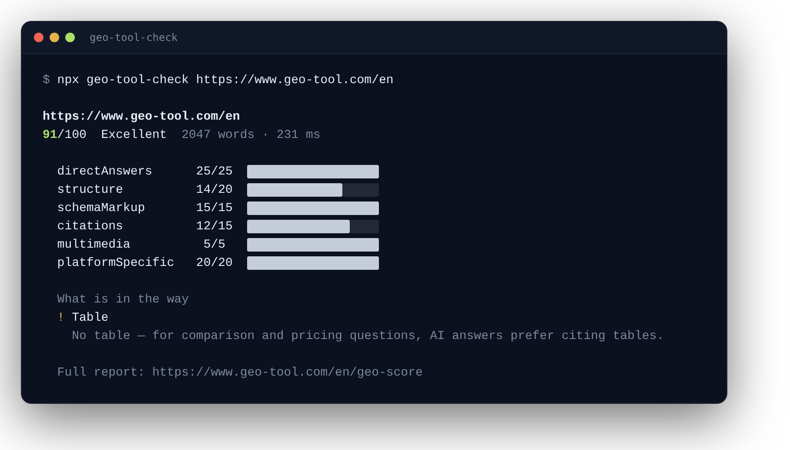

# geo-tool-check

[](https://www.npmjs.com/package/geo-tool-check)
[](https://github.com/geo-tool-com/geo-tool-check/actions/workflows/ci.yml)
[](https://registry.modelcontextprotocol.io/v0/servers?search=geo-tool-check)
[](https://www.npmjs.com/package/geo-tool-check)
[](LICENSE)

**Is this page readable for AI search?** One command answers it: crawler
access, structure, and citability for ChatGPT, Perplexity, Claude, and
Google AI — scored 0–100 with concrete findings.

```bash
npx geo-tool-check example.com
```



**Everything runs on your machine.** No account, no API key, no telemetry —
nothing is ever sent to geo-tool.com. The score is computed by the same engine
as the free [website audit on geo-tool.com](https://www.geo-tool.com), so the
number here matches the number there.

- **npm:** [`geo-tool-check`](https://www.npmjs.com/package/geo-tool-check) —
  Node 18+, zero runtime dependencies
- **MCP registry:**
  [`io.github.shufflethis/geo-tool-check`](https://registry.modelcontextprotocol.io/v0/servers?search=geo-tool-check)
  (stdio server, ships in the package)
- **Hosted MCP, no install:** `https://www.geo-tool.com/mcp` (Streamable
  HTTP) · manifest
  [`/.well-known/mcp.json`](https://www.geo-tool.com/.well-known/mcp.json)
- **Docs:** [Copy-paste examples](examples/) ·
  [Getting started](docs/getting-started.md) · [CLI reference](docs/cli.md) ·
  [GitHub Actions](docs/github-actions.md) ·
  [How scoring works](docs/scoring.md) · [FAQ](docs/faq.md) ·
  [Troubleshooting](docs/troubleshooting.md) ·
  [Architecture](docs/architecture.md)

## When to use it

- _"Is example.com readable for AI search?"_ — full 0–100 score with findings
- _"Which AI crawlers does my robots.txt block?"_ — GPTBot, OAI-SearchBot,
  ClaudeBot, PerplexityBot, Google-Extended and more, each with what blocking
  it costs you
- _"Why doesn't my pricing page show up in ChatGPT answers?"_ — the findings
  name what is missing (direct answer, structure, schema, evidence)
- _"Is this draft worth citing?"_ — `check_citability` scores a text passage
  with no network request at all
- _Gate a deploy_ — `--min-score 70` turns the score into an exit code

**Not** for measuring whether AI answers actually mention your brand — that
is a different measurement: the hosted
[geo-tool.com workspace](https://www.geo-tool.com) checks real ChatGPT,
Perplexity, and Gemini answers for your buying-intent questions daily.

## Quick start

| I want to…                              | Run                                                     |
| --------------------------------------- | ------------------------------------------------------- |
| Score a page                            | `npx geo-tool-check example.com`                        |
| See which AI crawlers robots.txt blocks | `npx geo-tool-check example.com --crawlers`             |
| Gate a deploy in CI                     | `npx geo-tool-check https://example.com --min-score 70` |
| Get machine-readable output             | `npx geo-tool-check example.com --json`                 |
| Use it from an AI agent (MCP)           | `npx geo-tool-check --mcp` — [setup guide](docs/mcp.md) |

## Use it from an AI agent (MCP)

Almost every MCP client accepts this block
([per-client setup](docs/mcp.md), [config files to copy](examples/mcp/)):

```json
{
  "mcpServers": {
    "geo-tool-check": {
      "command": "npx",
      "args": ["-y", "geo-tool-check", "--mcp"]
    }
  }
}
```

Clients that speak Streamable HTTP to remote servers can skip the install and
use the hosted endpoint instead — same tools, rate-limited, fetches run
through geo-tool.com's infrastructure rather than your machine:

```bash
claude mcp add --transport http geo-tool https://www.geo-tool.com/mcp
```

The three tools, identical in both variants:

| Tool                 | Arguments                  | What it answers                                                           |
| -------------------- | -------------------------- | ------------------------------------------------------------------------- |
| `check_ai_readiness` | `url`, optional `lang`     | Full 0–100 readiness score with per-category breakdown and findings       |
| `check_ai_crawlers`  | `url`, optional `lang`     | Which AI crawlers (GPTBot, OAI-SearchBot, ClaudeBot, …) robots.txt blocks |
| `check_citability`   | `content`, optional `lang` | How quotable a draft passage is — no network request at all               |

## Claude Code plugin

Install once:

```
/plugin marketplace add geo-tool-com/geo-tool-check
/plugin install geo-tool-check@geo-tool
```

Then check any page with one command — works immediately, no restart needed:

```
/geo-tool-check example.com
```

## FAQ

**How do I check whether ChatGPT can read my website?**
`npx geo-tool-check example.com`. Two things must be true: robots.txt must
not block OpenAI's crawlers, and the content must exist in the plain HTML —
ChatGPT's crawlers do not execute JavaScript.

**Does robots.txt really affect AI visibility?**
It can end it. `Disallow: /` for GPTBot means OpenAI's systems never see
your content. The checker flags blocked **scored** crawlers separately from
training-only bots, because the consequences differ.

**Why does a JavaScript-rendered page score poorly?**
Because AI crawlers see what `curl` sees. If content only exists after
client-side rendering, models find an empty shell — the low score **is** the
finding. Fixes: SSR, static generation, or prerendering.

**Do I need an llms.txt file?**
Optional and cheap. Google states it does not use it; several AI tools read
it. The check detects a real one and ignores SPA catch-all fakes.

**Does geo-tool-check upload my content anywhere?**
No. Every fetch goes from your machine to the target site — never to
geo-tool.com. The build fails if a bundle would try.

More: [full FAQ](docs/faq.md).

## Honest limits

Node runs no JavaScript — and neither do GPTBot, ClaudeBot, or PerplexityBot.
A client-rendered page that scores low here **is the finding, not a
measurement gap**. To compare the crawler's view against the rendered page,
use the [browser extension](https://www.geo-tool.com/en/ext-report).

This checker measures whether a page **can** be read and cited. Whether AI
systems actually mention your brand in real answers is a different
measurement: the hosted [geo-tool.com workspace](https://www.geo-tool.com)
checks real AI answers (ChatGPT, Perplexity, Gemini) for your buying-intent
questions daily.

## Links

- npm: [geo-tool-check](https://www.npmjs.com/package/geo-tool-check)
- MCP Registry:
  [io.github.shufflethis/geo-tool-check](https://registry.modelcontextprotocol.io/v0/servers?search=geo-tool-check)
- Browser extension:
  [geo-tool-com/geo-tool-extension](https://github.com/geo-tool-com/geo-tool-extension)
- Smithery:
  [tracktronaut/geo-tool-check](https://smithery.ai/server/tracktronaut/geo-tool-check)
- Docs: [geo-tool.com/en/developers](https://www.geo-tool.com/en/developers)

## License

MIT. Built by [track by track GmbH](https://www.geo-tool.com).
